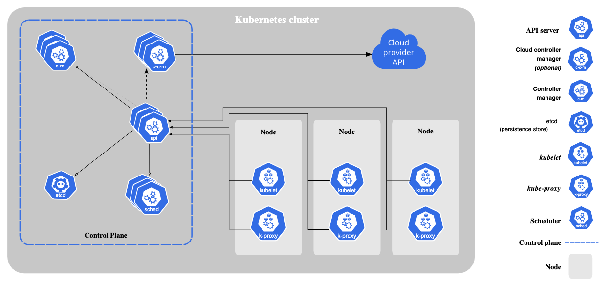

# Kubernetes:
## Differences between Kubernetes and Docker Swarm:
*Scaling:*
Kubernetes: Kubernetes excels in handling large-scale deployments, efficiently managing thousands of containers across multiple nodes. It provides advanced scaling capabilities, such as auto-scaling based on resource usage.
Docker Swarm: Docker Swarm is capable of scaling applications, but it's generally more suitable for smaller workloads. It may not handle as large deployments as efficiently as Kubernetes.

*Portability:*
Kubernetes: Kubernetes has become the industry standard for container orchestration and is supported by major cloud providers, making it highly portable across different environments.
Docker Swarm: Docker Swarm is tightly coupled with Docker, which may limit its portability in some cases. It's generally more suitable for environments where Docker is already extensively used.

## Kubernetes Components:

#### Control Plane Components:
*Kube-apiserver:*
 The Kubernetes API server acts as the frontend for the Kubernetes control plane. It exposes the Kubernetes API, which clients (like kubectl) use to interact with the cluster. All administrative tasks and cluster state changes are handled via the API server.

*Etcd:*
Consistent and highly-available key value store used as Kubernetes' backing store for all cluster data.
If your Kubernetes cluster uses etcd as its backing store, make sure you have a back up plan for the data.

*Kube-scheduler:*
Control plane component that watches for newly created Pods with no assigned node, and selects a node for them to run on.

*Kube-controller-manager:*
Control plane component that runs controller processes.
There are many different types of controllers. Some examples of them are:
*Node controller:* Responsible for noticing and responding when nodes go down.
*Job controller:* Watches for Job objects that represent one-off tasks, then creates Pods to run those tasks to completion.
*EndpointSlice controller:* Populates EndpointSlice objects (to provide a link between Services and Pods).
*ServiceAccount controller:* Create default ServiceAccounts for new namespaces.

*Cloud-controller-manager:*
It lets you link your cluster into your cloud provider's API

*Node controller:*
- Update a Node object with the corresponding server's unique identifier obtained from the cloud provider API.
- Annotating and labelling the Node object with cloud-specific information, such as the region the node is deployed into and the resources (CPU, memory, etc) that it has available.
- Obtain the node's hostname and network addresses.
- Verifying the node's health. In case a node becomes unresponsive, this controller checks with your cloud provider's API to see if the server has been deactivated / deleted / terminated. If the node has been deleted from the cloud, the controller deletes the Node object from your Kubernetes cluster.

*Route controller:*
- The route controller is responsible for configuring routes in the cloud appropriately so that containers on different nodes in your Kubernetes cluster can communicate with each other.
- Depending on the cloud provider, the route controller might also allocate blocks of IP addresses for the Pod network.

*Service controller:*
- Services integrate with cloud infrastructure components such as managed load balancers, IP addresses, network packet filtering, and target health checking.
- The service controller interacts with your cloud provider's APIs to set up load balancers and other infrastructure components when you declare a Service resource that requires them.

---

#### Node Components:
Node components run on every node, maintaining running pods and providing the Kubernetes runtime environment.

*kubelet:*
- An agent that runs on each node in the cluster. It makes sure that containers are running in a Pod.
- The kubelet takes a set of PodSpecs that are provided through various mechanisms and ensures that the containers described in those PodSpecs are running and healthy.
- The kubelet doesn't manage containers which were not created by Kubernetes.

*kube-proxy:*
- kube-proxy is a network proxy that runs on each node in your cluster, implementing part of the Kubernetes Service concept.
- kube-proxy maintains network rules on nodes. These network rules allow network communication to your Pods from network sessions inside or outside of your cluster.
- kube-proxy uses the operating system packet filtering layer if there is one and it's available. Otherwise, kube-proxy forwards the traffic itself.

*Container runtime:*
- A fundamental component that empowers Kubernetes to run containers effectively. It is responsible for managing the execution and lifecycle of containers within the Kubernetes environment.
- Kubernetes supports container runtimes such as containerd, CRI-O, and any other implementation of the Kubernetes CRI (Container Runtime Interface)